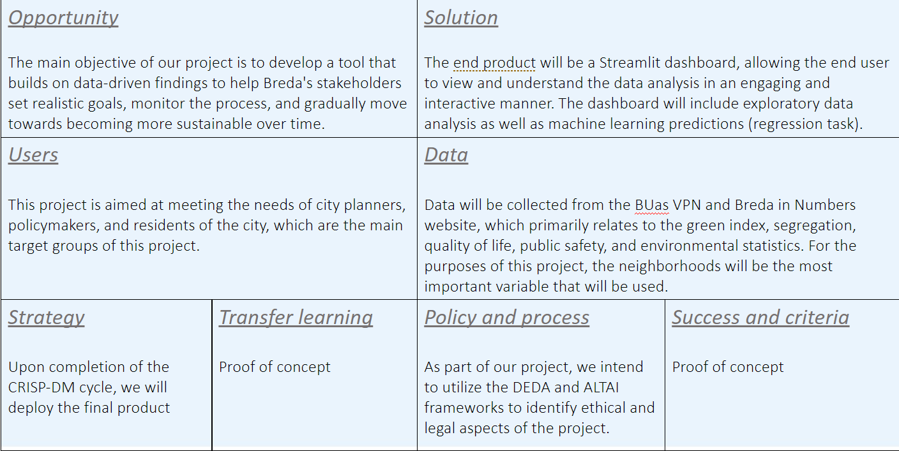
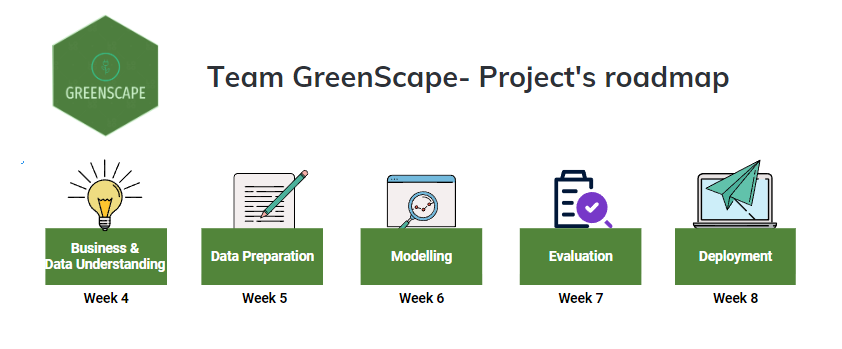

# GreenScape - Github repository for Block D's project
## **1. Business Understanding**
### By analyzing the factors that have an impact on the Green Index score, the client can allocate resources efficiently and effectively to address the most pressing environmental challenges. By tracking changes in each factor over time, Breda can set realistic goals and monitor its progress toward becoming more sustainable in a completely data-driven manner. We will analyze the correlation between Quality of life, Public Safety, Segregation, and Environmental statistics with the green index score to determine if we are able to predict a green index score using regression task for each neighborhood in Breda. ​
## **2. Research Questions**
### 1. What are the factors that might contribute to the green index score?​
### 2. Based on these factors, can we predict a green index score?​
## **3. AI Canvas**

## **4. Project's Roadmap**

[Click Here](roadmapInfo.md), to learn more details about our project's roadmap!